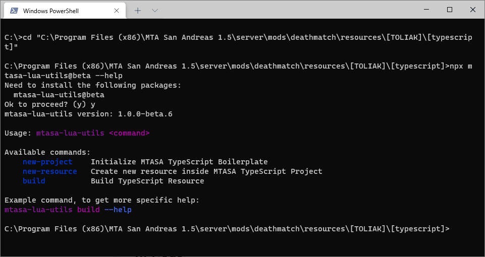
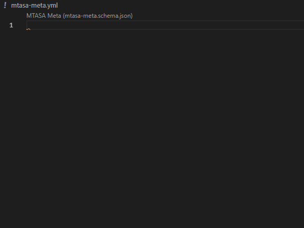

# TypeScript Resource Boilerplate for MTASA

Write and compile TypeScript into MTASA-compatible Lua code.

A documentation in your IDE. Types safety. Linting.

**Features**

- 🔥 [TypeScriptToLua](https://www.npmjs.com/package/typescript-to-lua)  
    Provides compilation
- 📓 [MTASA Lua Types](https://www.npmjs.com/package/mtasa-lua-types)  
    Provides types declarations and the documentation for MTASA functions, variables and classes
- ✅ [MTASA Lua Utils](https://www.npmjs.com/package/mtasa-lua-utils)  
    Provides code preparation and MTASA specific linting
- ✒️ [Prettier](https://www.npmjs.com/package/prettier)  
    Code formatter
- 👀 [ESLint](https://eslint.org/)  
    ESLint for linting TypeScript Code

# Getting started

## NodeJS

This boilerplate requires NodeJS (at least **14.x**) to be installed.
If you already have NodeJS installed, skip this step.

Installation for [Windows](https://nodejs.org/en/download/).

Installation for Linux:

_Debian or Ubuntu_

```shell
apt install nodejs
```

_Arch or Manjaro_

```shell
pacman -S nodejs
```

### How to check NodeJS installation (and version)

Open console
[(What?)](https://www.howtogeek.com/235101/10-ways-to-open-the-command-prompt-in-windows-10/#:~:text=Press%20Windows%2BR%20to%20open,open%20an%20administrator%20Command%20Prompt.)
and execute the command

```shell
npm version
```

## Create new project (initialize boilerplate)

Open terminal in the parent folder of your new project and run folowwing command:

```console
npx mtasa-lua-utils new-project
```



### Structure

```
|- .idea/                     Configs for WebStorm
|- .github/                   Configs for GitHub
|- .vscode/                   Configs for VSCode
|- node_modules/              Modules for NodeJS (autogenerated directory)
|- src/                       Directory with TypeScript resources
    |- TypeScriptResource/    Example Resource
|- types/                     Directory with additional types
|- mtasa-meta.yml             Description for all resources (meta.xml analog)
```

## Compile the project

Command:

```shell
npm run build
```

Always running the command to build the resource is annoying.
Below there are possible solutions to simplify it.

# Code Editor Preparation

## VSCode

### Using documentation

`Ctrl+Mouse Hover` is the shortcut to show documentation window.

`Ctrl+Shift+Space` is the shortcut to show function's parameters.

### Tasks

Use `Ctrl+Shift+B` and select `npm: build` task to compilte the resource.

### Trigger on save

Plugin [Trigger Task On Save](https://marketplace.visualstudio.com/items?itemName=Gruntfuggly.triggertaskonsave)
should be installed.

Configuration provided in [.vscode/settings.json](.vscode/settings.json) and will be enabled by default.

### YAML Schema

Plugin [YAML](https://marketplace.visualstudio.com/items?itemName=Gruntfuggly.triggertaskonsave)
should be installed.

Provides helpful tips for `mtasa-meta.yml` file.



## WebStorm

### Using documentation

`Ctrl+Q` is the shortcut to show documentation window.

`Ctrl+P` is the shortcut to highlight function's parameters.

### Configuration

**NOTE**: In the current version configuration should have been loaded by default.

In the top right corner press `Edit Configurations`.
Press `Add New Configuration` (Plus icon), select `npm` and select **build** in `Scripts` field.


Now you can press `Shift+F10` to compile your resource.

### File watcher

**NOTE**: In the current version file watcher should have been loaded by default.

Compile can be executed after file saving.

Open `Settings` -> `Tools` -> `File watchers`.
Add new file watcher for TypeScript files in project scope.
Put **npm** into the `Script` field and **run build** into the `Srguments` field.


Thus, saving after editing TypeScript files triggers compilation.
